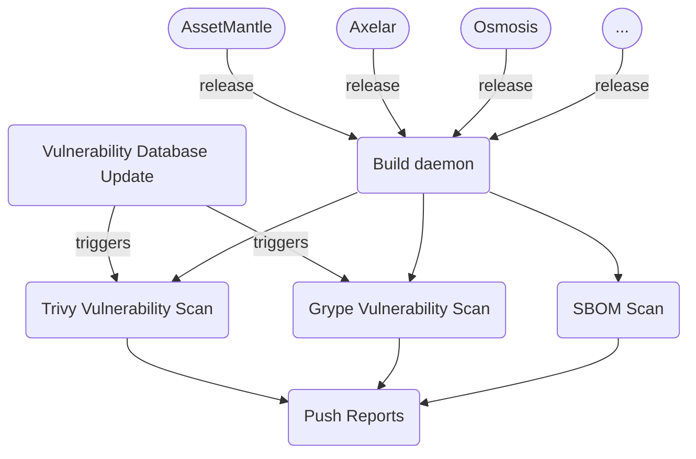

# [Chains Security Metrix by AsGuard](https://pratikbin.github.io/chain-reports/)

```mermaid

flowchart TB
  A([AssetMantle]) -->|release| cib(Build daemon)
  B([Axelar]) -->|release| cib
  C([Osmosis]) -->|release| cib
  D([...]) -->|release| cib

  bdu(Vulnerability Database Update) -->|triggers| ts(Trivy Vulnerability Scan)
  bdu -->|triggers| gs(Grype Vulnerability Scan)
  cib --> ts
  cib --> gs
  cib --> sbom(SBOM Scan)

  ts --> pr(Push Reports)
  gs --> pr
  sbom --> pr

```
