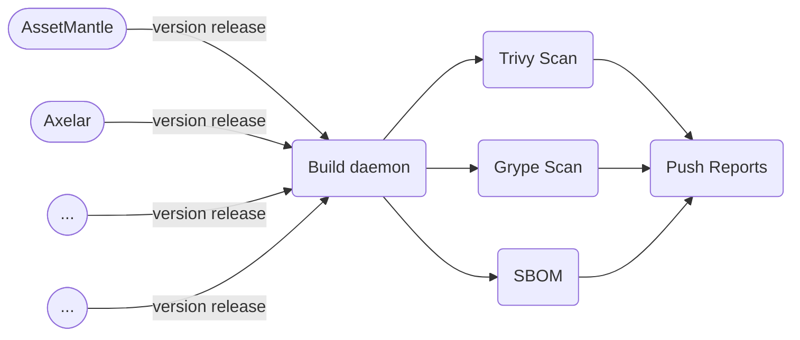

# [Chains Security Metrix by AsGuard](https://pratikbin.github.io/chain-reports/)

## Chains in Security Matrix

* [assetmantle](https://github.com/AssetMantle/node)

* [axelar](https://github.com/axelarnetwork/axelar-core)

* [basilisk](https://github.com/galacticcouncil/Basilisk-node)

* [bitcanna](https://github.com/BitCannaGlobal/bcna)

* [bitsong](https://github.com/bitsongofficial/go-bitsong)

* [bostrom](https://github.com/cybercongress/go-cyber)

* [carbon](https://github.com/Switcheo/carbon-bootstrap)

* [cheqd](https://github.com/cheqd/cheqd-node)

* [comdex](https://github.com/comdex-official/comdex)

* [gaia](https://github.com/cosmos/gaia)

* [crescent](https://github.com/crescent-network/crescent)

* [cronos](https://github.com/crypto-org-chain/cronos)

* [cryptoorgchain](https://github.com/crypto-org-chain/chain-main)

* [decentr](https://github.com/Decentr-net/decentr)

* [desmos](https://github.com/desmos-labs/desmos)

* [dig](https://github.com/notional-labs/dig)

* [emoney](https://github.com/e-money/em-ledger)

* [evmos](https://github.com/tharsis/evmos)

* [fetchhub](https://github.com/fetchai/fetchd)

* [gravitybridge](https://github.com/Gravity-Bridge/Gravity-Bridge)

* [ibc-go-simd](https://github.com/cosmos/ibc-go)

* [irisnet](https://github.com/irisnet/irishub)

* [juno](https://github.com/CosmosContracts/juno)

* [kichain](https://github.com/KiFoundation/ki-tools)

* [likecoin](https://github.com/likecoin/likecoin-chain)

* [lumnetwork](https://github.com/lum-network/chain)

* [neutron](https://github.com/neutron-org/neutron)

* [omniflixhub](https://github.com/OmniFlix/omniflixhub)

* [onomy](https://github.com/onomyprotocol/onomy)

* [regen](https://github.com/regen-network/regen-ledger)

* [sentinel](https://github.com/sentinel-official/hub)

* [sifchain](https://github.com/Sifchain/sifnode)

* [sim](https://github.com/cosmos/cosmos-sdk)

* [sommelier](https://github.com/peggyjv/sommelier)

* [stargaze](https://github.com/public-awesome/stargaze)

* [stride](https://github.com/Stride-Labs/stride)

* [tendermint](https://github.com/tendermint/tendermint)

* [terra](https://github.com/terra-money/core)

* [vidulum](https://github.com/vidulum/mainnet)

> powerd by heighliner
